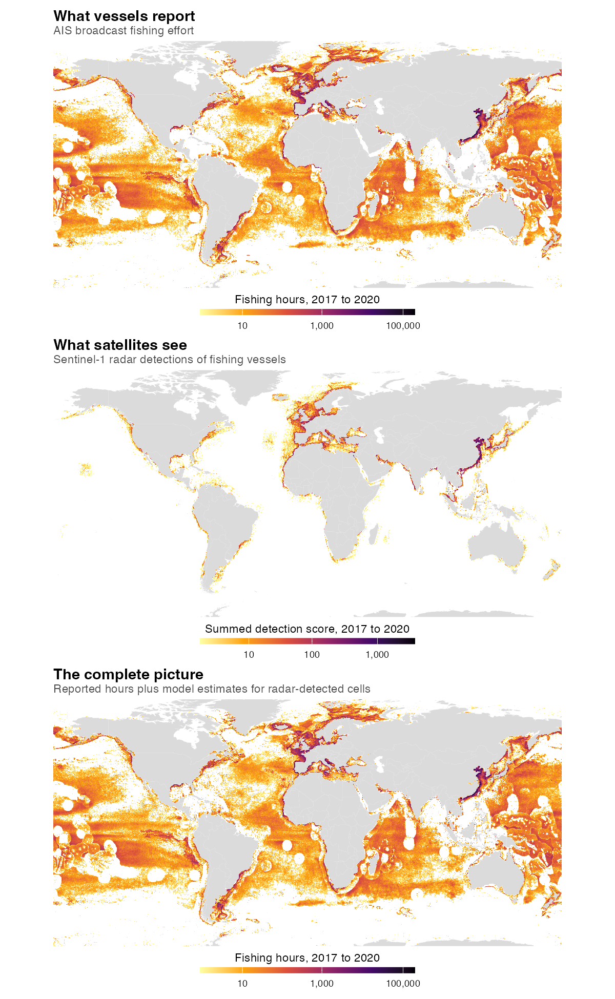

# Mapping fishing effort beyond AIS

Estimating global fishing effort where vessels stop broadcasting, by combining
AIS with Sentinel-1 satellite radar using a random forest.



## What this does

Public monitoring of industrial fishing leans heavily on AIS, the transceiver
system vessels use to broadcast their position. Coverage is uneven: not every
vessel carries it, not every vessel keeps it switched on, and satellite reception
varies by region. Sentinel-1 radar sees vessels regardless of what they broadcast,
but a radar detection tells you only that something was there, not how long it
fished.

A random forest is trained on cells where both signals exist, then used to predict
fishing hours in cells where only radar detections are available.

- **Panel A**: AIS fishing effort, 2017 to 2020
- **Panel B**: Sentinel-1 SAR detections of fishing vessels, same period
- **Panel C**: reported hours plus model estimates for radar-detected cells

Predictors are SAR detections per satellite overpass, coordinates, distance to
shore, distance to port and bathymetry, at 0.1 degree resolution. R-squared is
0.77 on cells where both signals report.

## On normalising by overpass frequency

An earlier version of the model used raw SAR detection counts and scored higher
(R-squared 0.82). That version was partly exploiting uneven satellite coverage:
cells overflown more often accumulate more detections regardless of how much
fishing happens there, so the model was learning the orbit as much as the fishery.
Normalising by overpass frequency removes the artefact at the cost of some
apparent accuracy. The normalised model is the one used here.

The report includes a comparison of four transformation strategies.

## Data

Not included in this repository, and too large for git. Both sources are public
and available from Global Fishing Watch:

- **AIS fishing effort**: Kroodsma et al. (2018), *Science*
- **SAR vessel detections**: Paolo et al. (2024), *Nature*

https://globalfishingwatch.org/data-download/

Bathymetry and distance-to-shore and distance-to-port rasters are resampled to the
same 0.1 degree grid. To reproduce, download the sources and place them under
`R/Data/` following the paths in `fishing_figure.qmd`.

## Running it

Requires [Quarto](https://quarto.org) and R with `dplyr`, `ggplot2`, `maps`,
`scales`, `patchwork` and `knitr` for the report, plus `data.table`, `raster` and
`randomForest` to build the panel data and model metrics from source.

```bash
quarto render fishing_figure.qmd
```

The first run does the raster join, the prediction and the model evaluation, then
caches the results to `R/Data/figure_cache.Rdata`. Later runs load the cache and
redraw in seconds. Delete that file to rebuild.

## Report template

The `Quarto_template/` folder holds the styling: a stylesheet plus two HTML
fragments referenced from the YAML header. Swapping the colour tokens and the
footer produces a different identity without touching any analysis code. It is
documented separately at
[quarto-report-template](https://github.com/TheophileMt92/quarto-report-template).

## Status

This figure supports a manuscript in preparation on global elasmobranch
conservation prioritisation. The code is shared for transparency. Please get in
touch before reusing it in published work.

## Author

Théophile L. Mouton, quantitative ecologist and data consultant.
[theophile-mouton.com](https://theophile-mouton.com)
